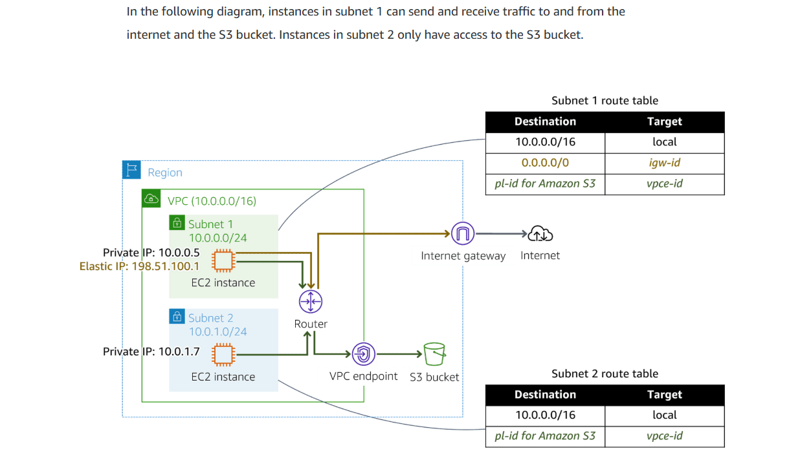
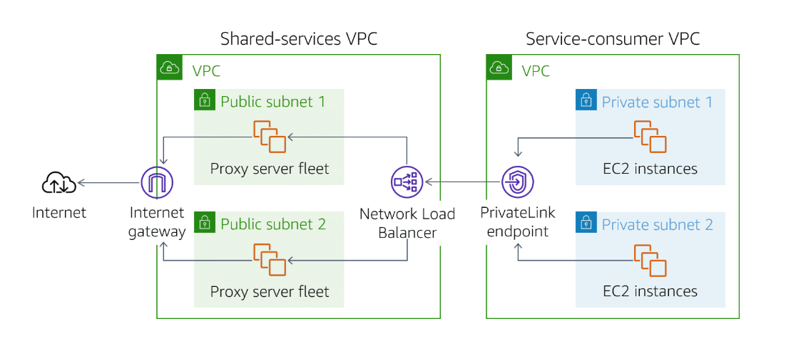
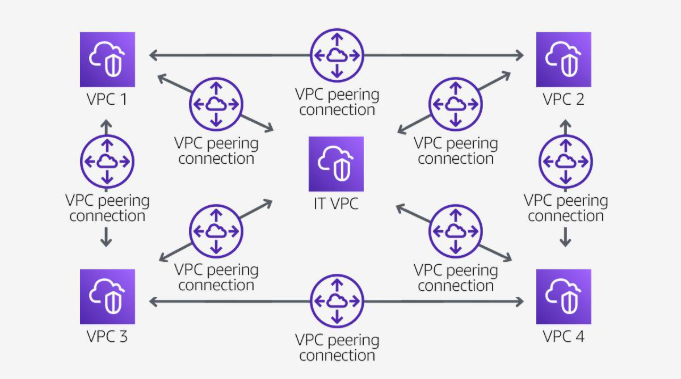
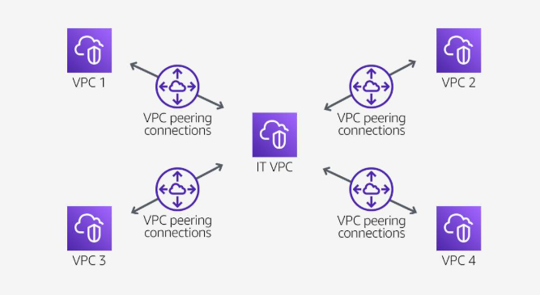
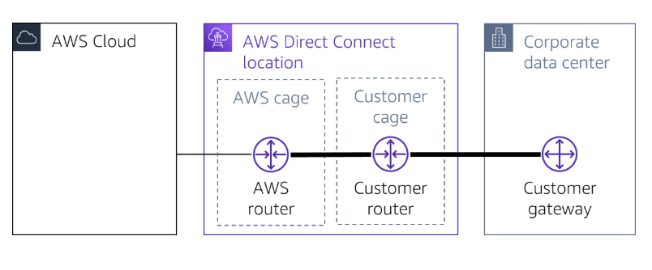
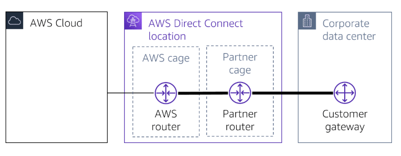
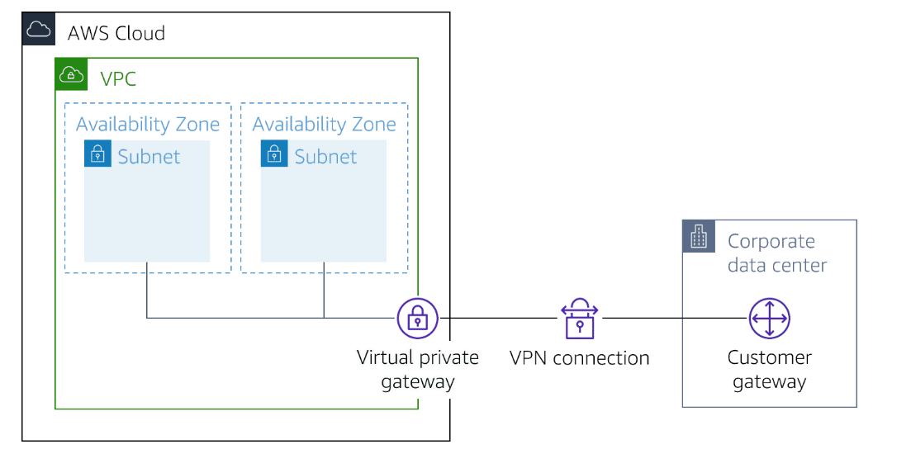
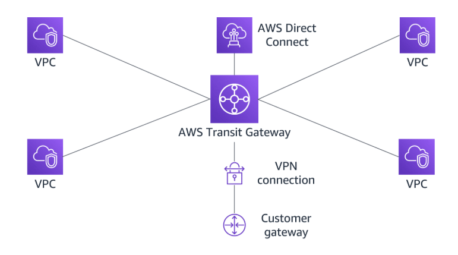
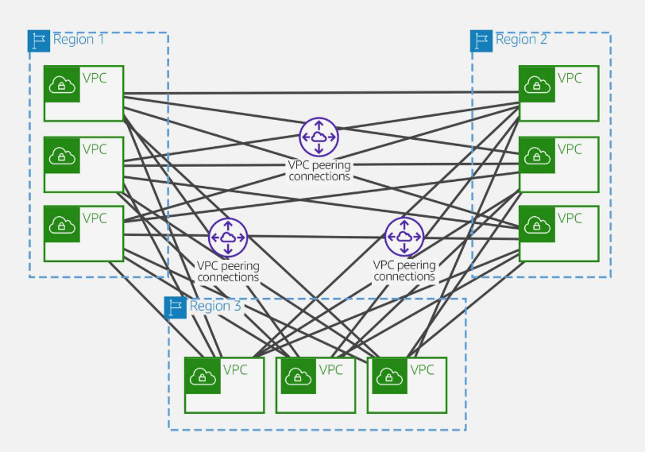
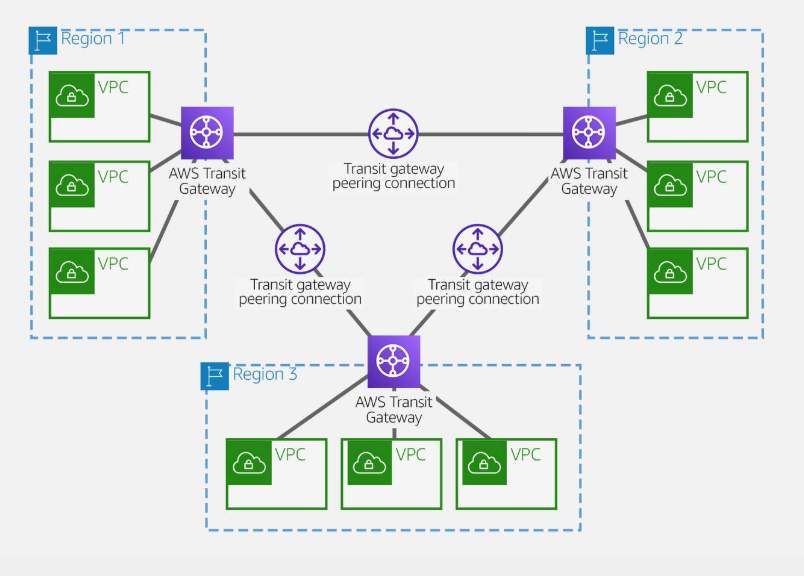

# 01 AWS Networking Basics

## AWS Networking Services

### Network foundations

1. VPC
2. Transit gateway
3. Private link

### Hybird connectivity

1. Direct connection
2. Cloud WAN
3. Client VPN
4. Site-to-Site VPN

### Edge networking

1. CloudFront
2. Route53
3. Global Accelerator

### Application networking

1. API Gateway
2. App Mesh
3. Cloud Map

### Networking security

1. Firewall Manager
2. Shield
3. Network Firewall
4. WAF

## Network Concepts

### Network design pattern

1. point to point
2. Bus
3. Tree
4. Hub and Spoke
5. Mesh
6. Ring
7. Hybrid

### Protocol

1. Network management protocols

- HTTP
- TCP
- UDP
- IRC(Internet Relay Chat): is a text-based communication protocol

2. Network communication protocols

- SNMP
- ICMP

3. Network security protocols

- SSL
- SFTP
- HTTPS

### IPv4

32 bit digis, 0.0.0.0 to 255.255.255.255

### IPv6

## Classless Inter-Domain Routing (CIDR)

- CIDR management ip address space
- CIDR reduce the number of table entries

### Subnetting

- Host and network
- class A 205.0.125.100, network : 205, host :0.125.100.
- class B 205.0.125.100, network : 205.0, host : 125.100.
- class C 205.0.125.100, network : 205.0.125, host : 100.

### Subnet mask

For determine the number of IP address by given local network requires based on the default subnetwork.

#### Accessing data

- Network attached storage(NAS): Elastic file system, Amazon FSx.
- Storage area network(SAM): Amazon Elastic Block Storage(EBS).

## AWS Implementation

### Open Systems Interconnect(OSI) model

The OSI model contains 7 layers: physical layer, data link layer, network layer, transport layer, session layer, presentations layer, and application layer. These 7 layers are the networking stack, which is the software that completes each function.

### TCP/IP

1. Link
   MAC address

2. Internet
   IPv4

3. Transport
   TCP
4. Application
   HTTP

## AWS Network Connectivity Options

### Understant Connectivity Concepts

#### Multi-tier architecture

- Presentation tier
- Application or logic tier
- Data tier

#### Multi-VPC architecture

For Create connections between application for distributed applications

#### Hight avaliability

A network that is designed to avoid loss of communications between established network endpoints.

by implementation of :

- redeundant components
- parallel components
- distribute traffic load
- elimination of single point of faliure

#### Hybrid networks

At least two indepentdent networks communicate with each other.

#### high performance

Privide fastest experience by guiding a packet of data along the shortest path with minimal delay.

### Understant AWS Network Service Offerings

#### Virtual private cloud(VPC) endpoint and AWS PrivateLink

- Gateway VPC endpoints

  A gateway VPC endpoint targets specific IP routes in a VPC route table in the from of a prefix list.
  

- Interface endpoints

  Powered by privateLink, an interface endpoint is an elastic network interface with a private IP address from the IP address range of the subnet. as an entry point for traffic.

- Gateway Load Balancer endpoint

  A gateway load balancer endpoint is an elastic network interface with a private IP address from the IP address range of the subnet.traffic and route it to a service that configured using Gateway Load balancer.

- What is AWS PrivateLink

  

  1.  Provite connection between VPCs and supported AWS Services.
  2.  Avoids exposing traffic to the public internet.

Benefits :

1.  Security
2.  Simplification
3.  Capabilities

Considerations :

1.  Does not support IPv6.
2.  Service Provider will never see the IP address of the customer or service consumer.
3.  Endpoint services cannot be tagged.
4.  The private Domain Name System (DNS) of the endpoint does not resolve outside of the VPC.
5.  Availability Zone names in a customer account might not map to the same locations as Availability Zone names in another account.

- DNS
  DNS Will be created for interface endpoint.

  1.  Endpoint-specific regional DNS hostname.

      vpce-0fe5b17a0707d6abc-29p5708s.ec2.us-east-1.vpce.amazonaws.com

  2.  Zonal-specific DNS hostname.(include avaliable zone)

      vpce-0fe5b17a0707d6abc-29p5708s-us-east-1a.ec2.us-east-1.vpce.amazonaws.com

  3.  Private DNS hostname.

      Create for zonal-specific or regional-specific DNS into a friendly hostname.

      myservice.example.com

#### VPC peering

A network connection between two VPCs and route traffic privately.

- Benefits :

  1.  Highly avaliable.
  2.  does not relay on a separate pice of physical hardware.
  3.  no bandwidth bottleneck or single point of failure of communication.

- Peering scenarios

  1.  Full Sharing of resources between all VPCs
      
  2.  Partial sharing of centralized resources
      

- Non-valid peering configurations

  1.  Overlappiong CIDR blocks
  2.  Transitive peering
  3.  Edge-to-edge routing through a gateway or private connection

If either VPC in a peering relationship has one of the following connections, you cannot extend the peering relationship to that connection:

A VPN connection or a Direct Connect connection to a corporate network
An internet connection through an internet gateway

An internet connection in a private subnet through a NAT device

A gateway VPC endpoint to an AWS service, for example, an endpoint to Amazon S3

#### AWS Direct Connect

Direct connection privides a private, reliable connection to AWS private data center or office.

- Speed

  1.  All connections must be decicated connections and have a port speed of 1Gbps, 10 Gbps, 100Gbps.

  2.  All connection in the LAG must use the same bandwidth.

  3.  A LAG can have maximum of two 100-Gpbs connections or 4 connection port speed less than 100-Gpbs.

  4.  All connection in the LAG must terminate at the same Direct Connect endpoint.

  5.  when Create a LAG, you can download the letter of Aithorization and connecting Facility Assignment(LOA-CFA) for each physical connection.

- Network Requirement

  1.  Your network is co-located with an existing Direct connect location.
      
  2.  You are working with a Direct Connect Partner.
      
  3.  You are working with an independent service provider to connect to Direct Connect.

#### AWS Site-to-Site VPN and AWS Client VPN

- Enables you to securely connect your on-premises network to Amazon VPC.
- Enables you to securely connect users to AWS or on-premises network.
  

- Gateways

  1.  Customer gateway

      A resource you create and configred in AWS that represents your on-premise gateway device.

  2.  Customer gateway device

      A customer gateway device is a physical device or software application on your side of the AWS Site-to-Site VPN connection.

  3.  Virtual private gateway

      A virtual private gateway is the VPN connector on the Amazon side.

  4.  Transit gateway

      A transit gateway is a transit hub that can be used to interconnect your VPCs and on-premises network.

- Limitations

  1.  IPv6 traffic is partially supported.(IPv6 outter tunnel connection not supported)

  2.  Does not support Path MTU discovery.

  3.  Maximum packets per second(PPS) per VPN tunnel is 140,000.

  4.  ...

- Monitoring

  Use Cloud Watch, not support AWS Classic VPN connections.

- Client VPN

  Based on OpenVPN, Client VPN is a managed client-based VPN service that let you securely access your AWS resources and resources in your on-premises network.

  1.  Client VPN endpoint

  Your Client VPN administrator creates and configures a client VPN endpoint in AWS.

  2.  VPN client application

  Software that use to connect to the Client VPN endpoint and establish a secure VPN connection.

  3. Client VPN endpoint configuration file

  A configuration file that is provided to you by your Client VPN administrator.

  Limitations:

  1.  IPv6 is no supported.
  2.  Clinet CIDR ranges must have a block size of at least /22 and must not be greater than /12.

  Monitoring :
  Could Watch

#### AWS Transit Gateway

AWS Transit Gateway is a highly avaliable and scalable service that provide interconnectivity bwtween VPCs and on-premises network.

- Attachments

  AWS Transit Gateway supports the following connections:

  1.  One or more VPCs
  2.  A compatible Software-Defined Wide Area Network(SD-WAN) application.
  3.  A Direct Connect gateway.
  4.  A peering connection with another transite gateway.
  5.  A VPN connection to a transit gateway.

- AWS Transit Gateway MTU

  AWS Transit Gateway supports an MTU of 8500 bytes for :

  1.  VPC connections
  2.  Direct Connect connections.
  3.  Connections to other transit gateways.
  4.  Peering connections.

- AWS Transit Gateway route table

  A route table includes dynamic and static routes that decide the next hop basedon the destination IP address of packet.

- Associations

  Each attachment is associated with exatly one route table. each route table can be associated with zero to many attachments.

- Route propagation

  A VPC, VPN connection or Direct Connect gateway can dynamically propagate routes to a transit gateway route table.
  Whit a Direct Connect attachment, the routes are propagated to transit gateway route table by default.

  Whit a VPC, you must create static routes to send traffic to the transit gateway.

  With a VPN connection or a Direct Connect gateway, routes are propagated from the transit gateway to your on-premises router using BGP.

  With a peering attachment, you must create a static route in the transit gateway route table to point to the peering attachment.

  

  - AWS Transit Gateway inter-regional peering

  1.  VPC peering
      

  2.  transit gateway peering
      

#### Hub and Spoke

#### Hybird network

#### Cross-regional VPC peering

### Exploring Design Patterns
