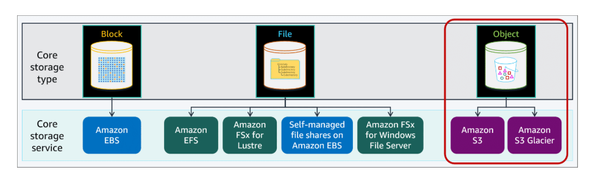

# 02 Core AWS Storage Services

## Block Storage

Low latency for high-performance workloads.

### EC2 instance Storage

Ephemeral storage

will lost when :

- The underlying disk drive fails
- The instance stops
- The instance hibernates
- The instance terminated

### EBS

Designed for data can be quickly accessible and requires long-term persistence.
suitble for file system, databases or any application that require fine-granular updates and access to raw.

Features:

1. Single Avaliability Zone
2. persistent
3. Volume types
4. Elastic volumes
5. High avaliability
6. Data encryption
7. Native snapshot support
8. AWS Backup support
9. Performance monitoring

User cases:

- Enterprise application
- Relational database
- Non-relational database/ NoSQL database
- Big data analytics
- File / Media Workflows

## File Storage

### EFS

Scalable, elastic, cloud-native file system for linux. support for NFS protocal.

- Standard storage classes

Standard-Infrequent Access(Standard-IA), offer Multi-AZ resilience and highest levels of durability and avaliability.

- One Zone storage classes

EFS One Zone IA and offer Single-AZ.

Features:

- Full managed
- High avaliability and durability
- Storage classes and lifecycle management
- Security and compliance
- Scalable performance
- Shared file systems with NFS v4.0 and v4.1 support
- Performance modes(General Purpose or Max I/O)
- Throughput modes(Bursting, Provisioned)
- Elastic and scalable
- Encryption
- Containers and serverless file storage
- Data transfer and backup

Use cases:

- Containers and serverless persistent file storage
- Move to managed file systems
- Analytics and machine learning
- Web serving and content management
- Application testing and development
- Media and entertainment
- Database backup

### FSx for Lustre

AWS fully managed parallel file system built on Lustre for high performance computing (HPC) workloads.

Lustre is a open-source, high-performance file system.

Features:

- High, scalable performance
- Seamless access to data repositories
- Simple and full managed
- Native-file-system compliant
- Cost optimized
- Secure and compliant

Use cases:

- Horizontal - Machine learning
- Horizontal - High performance computing
- Vertical - Genomics and life sciences
- Vertical - Media processing and transcoding
- Vertical - Autonomous vechicles
- Vertical - SAS Grid computing

### FSx(Windows Server)

Amazon FSx for Windows File Server is an AWS fully managed file system for Windows environments.

### FSx(NetApp ONTAP)

Amazon FSx for NetApp ONTAP is the NetApp ONTAP operating system implemented as a fully managed service.

### FSx(OpenZFS)

Amazon FSx for OpenZFS is an AWS fully managed implementation of the Open Zettabyte File System (ZFS).

## Object Storage : Amazon S3

Amazon Simple Storage Service (Amazon S3) is an object storage service that offers industry-leading scalability, data availability, security, and performance.

Use cases :

- Data lakes
- Websites
- Mobile application
- Backup and restore
- Archive
- Enterprise application
- IoT devices
- Big data analytics

Features:

- **Management and monitoring**

  - Storage management
  - Version control
  - Replication
  - Retention and compliance
  - Storage monitoring

- **Analytics and insights**

  - S3 storage Lens

  S3 Storage Lens delivers organization-wide visibility into object storage usage and activity trends.

  - S3 Storage Class Analysis

  Amazon S3 Storage Class Analysis analyzes storage access patterns to help you determine when to transition less frequently accessed storage to a lower-cost storage class.

- **Access management and Security**

  - Access management

    - IAM
    - ACLs
    - Access points with names and permissions
    - Query String Authentication with Temporary URLs(SignatureV4 ?)

  - On-premise connectivity

    Over AWS Direct Connect or AWS VPN

  - Encryption

    Use S3 management key(SSE-S3) or AWS Key management Service(KMS) keys

  - S3 Block Pulic Access

    S3 Block Public Access is a set of security controls that ensures S3 buckets and objects do not have public access.

  - Access Analyzer for S3

    Access Analyzer for S3 is a feature that monitors your bucket access policies, ensuring that the policies provide only the intended access to your S3 resources.

  - Amazon Macie

    You can use Amazon Macie to discover and protect sensitive data stored in Amazon S3.

- **Data Process and Query**

  - S3 Object Lambda

    S3 Object Lambda uses AWS Lambda functions to process the output of a standard S3 GET request automatically.

  - Query in place
    - S3 Select
    - Amazon Athena
    - Amazon Redshift Spectrum

Use Cases:

- Backup and restore
- Disaster recovery
- Archive
- Data lakes and big data analytics
- Hybrid cloud storage
- Cloud-native applications

