# 03 AWS Lambda Functions

## Introduce to Serverless

**AWS serverless platform**

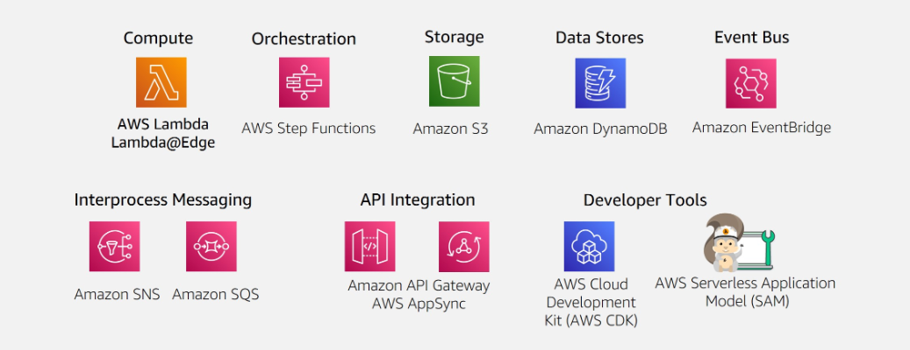

**What is Lambda**

- run code without servers
- initiates function for events
- scale automatically
- provide monitoring and logging via `Cloud Watch`

**Event-driven architectures**

An event-driven architecture uses events to initiate actions and communication between decoupled services.

**Producers, routers, comsumers**

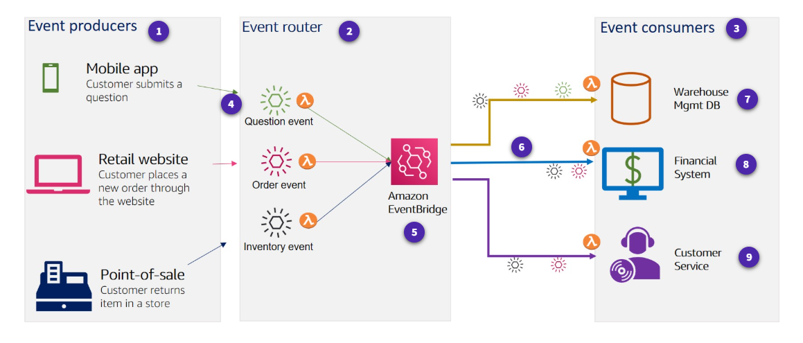

## How AWS Lambda works

### Invocation models for running Lambda functions

Event sources can invoke a Lambda function in three general patterns.

- Synchronous invocation

  - Synchronous events expect an immediate response from the function invocation.

  - no build-in retries

  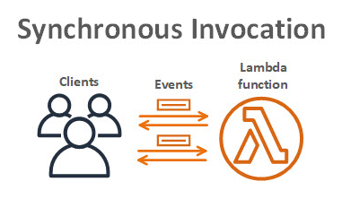

  - Sychonours AWS Services

    The following AWS services invoke Lambda synchronously:

        Amazon API Gateway
        Amazon Cognito
        AWS CloudFormation
        Amazon Alexa
        Amazon Lex
        Amazon CloudFront

- Asynchronours invocation

  - Async invocation

    When you invoke a function asynchronously, events are queued and the requestor doesn't wait for the function to complete.

    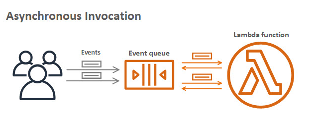

  - Async AWS service integration

    - Amazon SNS
    - Amazon S3
    - Amazon EventBridge

  - Destinations

    A destination can send records of asynchronous invocations to other services.

- Polling invocation

  - Polling

    This invocation model is designed to integrate with AWS streaming and queuing based services with no code or server management. Lambda will poll (or watch) these services, retrieve any matching events, and invoke your functions

    - Amazon Kinesis
    - Amazon SQS
    - Amazon DyanamoDB Strams

  - Event Srouce Mapping

    The configuration of services as event triggers is known as event source mapping. This process occurs when you configure event sources to launch your Lambda functions and then grant theses sources IAM permissions to access the Lambda function.

    - Amazon DynamoDB
    - Amazon Kinesis
    - Amazon MQ
    - Amazon Managed Streaming for Apache Kafka
    - Self-managed Apache Kafka
    - Amazon SQS

### Invocation model error behavior

| Invocation Model | Error Behavior           |
| ---------------- | ------------------------ |
| Synchronous      | No retries               |
| Asynchronous     | Built in – retries twice |
| Polling          | Depends on event source  |

### Lambda execution environment

Lambda invokes your function in an execution environment, which is a secure and isolated environment.

- Execution environment lifecycle

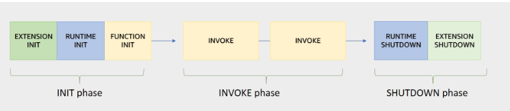

- Init phase

  In this phase, Lambda creates or unfreezes an execution environment with the configured resources, downloads the code for the function and all layers, initializes any extensions, initializes the runtime, and then runs the function’s initialization code (the code outside the main handler).

  Sub-phase:

  1. Extension init - starts all extensions
  2. Runtime init - boostraps the runtime
  3. Function init - run the function's static code

- Invoke pahse

  In this phase, Lambda invokes the function handler.

- Shutdown phase

  If the Lambda function does not receive any invocations for a period of time, this phase initiates. In the Shutdown phase, Lambda shuts down the runtime, alerts the extensions to let them stop cleanly, and then removes the environment.

### Performance optimizetion

- Cold and warm starts

  A cold start occurs when a new execution environment is required to run a Lambda function.

  In a warm start, the Lambda service retains the environment instead of destroying it immediately.

  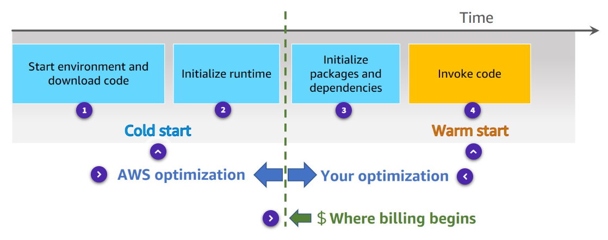

- Best practice: Minimize cold start times

  For most applications, cold start is not a problem, however, for some synchronous models, thislatency can inhibit optimal performance.

  1. Optimize your function.
  2. Use `Provisioned concurrency`, it can prepare concurrent execution environment before invocations.

- Best practice : Write functions to take advantage of warm starts

  1. Store and reference dependencies locally
  2. Limit re-initialization of variables
  3. Add code to check for and reuse existing connections
  4. Use tmp space as transient cache
  5. Check that background processes have completed.

## AWS Lambda Function Permissions

With Lambda functions, there are two sides that define the necessary scope of permissions – permission to invoke the function, and permission of the Lambda function itself to act upon other services.

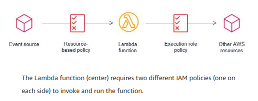

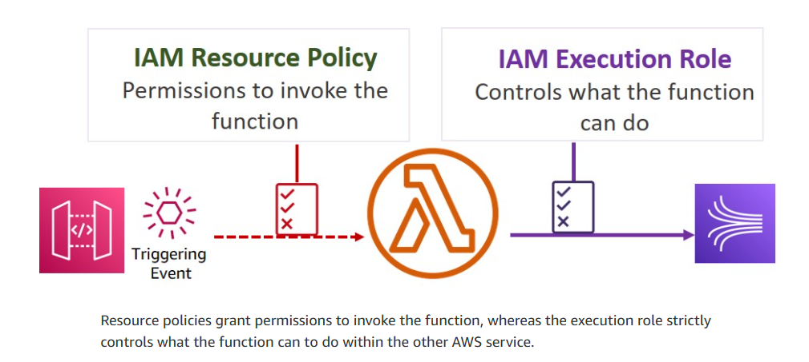

### Execution role

The execution role gives your function permissions to interact with other services.

Example : Execution role definitions

- IAM policy

```json
"Version": "2012-10-17",
  "Statement" : [
    {
      "Sid": "Allow PutItem in table/test",
      "Effect": "Allow",
      "Action": "dynamodb:PutItem",
      "Resource": "arn:aws:dynamodb:eu-west-2:###:table/test"
    }
  ]
```

- Trust policy

A trust policy defines what actions your role can assume. The trust policy allows Lambda to use the role's permissions by giving the service principal lambda.amazonaws.com permission to call the AWS Security Token Service (AWS STS) AssumeRole action.

```json
{
  "Effect": "Allow",
  "Action": "sts:AssumeRole",
  "Principal": {
    "Service": "lambda.amazonaws.com"
  }
}
```

### Resource-based policy

A resource policy (also called a function policy) tells the Lambda service which principals have permission to invoke the Lambda function. An AWS principal may be a user, role, another AWS service, or another AWS account.

### Policy comparison

- Resource-based policy

  Lambda resource-based policy

  - Associated with a "push" event srouce such as Amazon API gateway
  - Created when you add a trigger to a Lambda function
  - Allows the event source to take the lambda:invokeFunction action

- Execution role

  IAM execution role

  - Role selected or created when you create a lambda function
  - IAM Policy includes actions you can take with the resource
  - Trust policy that allows Lambda to AssumeRole
  - Creator must have permission for iam:PassRole

- Example resource policy

```json
"Version" : "2012-10-17",
"Id" : "test-policy",
"Statement" : [
  {
    "Sid": "lambdaInvoke",
    "Effect": "Allow",
    "Principal": {
      "Service": "s3.amazonaws.com"
    },
    "Action": "lambda:InvokeFunction",
    "Resource": "arn:aws:lambda:eu-west-2:###:function:test",
    "Condition": {
      "ArnLike": {
        "AWS:SourceArn": "arn:aws:s3:::test-bucket"
      }
    }
  }
]
```

### Accessing resources in a VPC

Enabling your Lambda function to access resources inside your virtual private cloud (VPC) requires additional VPC-specific configuration information, such as VPC `subnet IDs` and `security group IDs`.

- Lambda and AWS PrivateLink

  To establish a private connection between your VPC and Lambda, create an interface VPC endpoint.

## Authoring AWS Lambda functions

- learn best practice for writing Lambda function code.

### Use your own code

- Supported languages

  Node.js, C#...

- Start with the handler method

  The Lambda function handler is the method in your function code that processes events.

  The handler method takes two objects

  - Event Ojbect

    - required
    - when lambda invoked, `event object` will be provide to handler
    - event object is different
    - inlcude metadata your lambda function needs

  - Context Object (optional)

    - allow you function code to interact with the lambda execution environment.
    - The content and structure based on language runtime, minimum element contains:
      - `AWS RequestID`
      - `Runtime`
      - `Logging`

- Design best practices

  1. Separate business logic

  Separate your core business logic from the handler event.
  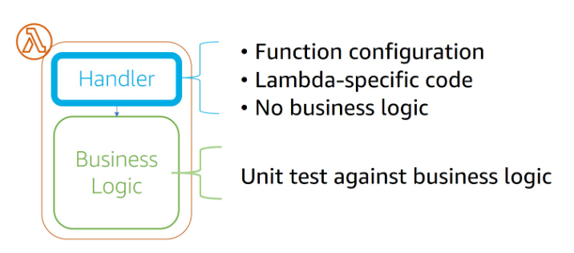

  2. Write modular functions

  Module functions will reduce the amount of time that it takes for your deployment package to be downloaded and unpacked before invocation.

  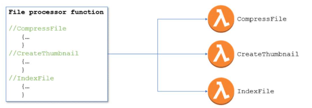

  3. Treat functions as stateless

  No information about state should be saved within the context of the function itself.

  Consider one of the following options for storing state data:

  - DynamoDB
  - ElasticCache
  - S3

  4. Only include what you need

  Minimize both your deployment package dependencies and its size.
  This can have a significant impact on the startup time for your function.

- Best parctices for writing code

  1. Include logging statements

     Lambda functions can and should include logging statements, which are written to CloudWatch.

     example

     ```python
     import os
     import logging
     logger = logging,getLogger()
     logger.setLevel(logging.INFO)

     def lambda_handler(event, context):
       logger.info('## ENVIRONMENT VARIABLES')
       logger.info(os.environ)
       logger.info(event)
     ```

  2. Use return coding

     Functions must give Lambda information about the results of their actions.

     ```js
     exports.handler = async function (event, context) {
       console.log("EVENT: \n" + JSON.stringify(event, null, 2));
       return context.logStreamName;
     };
     ```

  3. Provide environment variables

     - Take advantage of environment variables for operational parameters.

     - You can use these parameters to pass updated configuration settings without changes to the code itself.

     - You can also use environment variables to store sensitive information required by the function.

  4. Add secret and refernce data

     AWS Secrets Manager helps you organize and manage important configuration data such as credentials, passwords, and license keys.

  5. Avoid recursive code

     Avoid a situation in which a function calls itself.

     Recursive code could lead to uncontrolled scaling of invocations that would make you lose control of your concurrency.

  6. Gather metrics with Amazon `CloudWatch`

     The CloudWatch embedded metric format (EMF) is a JSON specification used to instruct CloudWatch Logs to automatically extract metric values embedded in structured log events.

  7. Reuse execution context

     1. Store dependencies locally.

     2. Limit re-initialization of variables.

     3. Reuse existing connections.

     4. Use tmp space as transient cache.

     5. Check that background processes have completed.

### Building Lambda functions

- Lambda console editor

  You can author functions within the Lambda console, with an IDE toolkit, using command line tools, or using the AWS SDKs.

- Deployment packages

  Your Lambda function's code consists of scripts or compiled programs and their dependencies.

- Automate using tools

  Serverless applications built using Lambda are a combination of Lambda functions, event sources, and other resources defined using the AWS Serverless Application Model (AWS SAM).

### What is SAM

AWS SAM is an open-source framework for building serverless applications. It provides shorthand syntax to express functions, APIs, databases, and event source mappings. With just a few lines per resource, you can define the application you want and model it using YAML. You provide AWS SAM with simplified instructions for your environment and during deployment AWS SAM transforms and expands the AWS SAM syntax into AWS CloudFormation syntax (a fully detailed CloudFormation template).

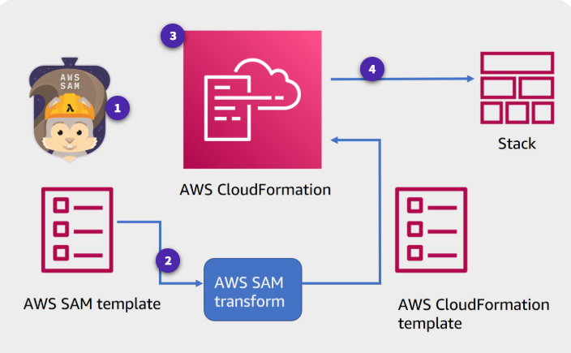

- SAM prebuild policies
  AWS SAM provides a number of predefined, commonly used templates that you can use to build for least privilege security access.

- SAM CLI can test and deploy the lambda function

  1. Invoke functions and run automated tests locally.
  2. Generate sample event srouce payloads.
  3. Run api gateway locally.
  4. Debug code.
  5. Review Lambda function logs.
  6. Validate AWS SAM templates.

  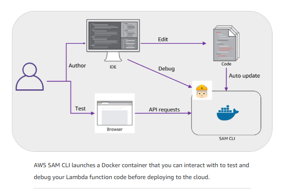

- AWS SAM CLI

  1. init

     Initializes a serverless application.

  2. local
     Runs application locally

  3. validate

     Validates an AWS SAM template.

  4. deploy

     Deploys an sam application

  5. build

     Builds a serverless application and prepares it for subsequent steps in your workflow.

- Serverless CI/CD pipeline

  - CodeBuild - Automate the process of packaging code and run tests
  - CodeDeploy - Use Version management options to ensure safe deployments.

  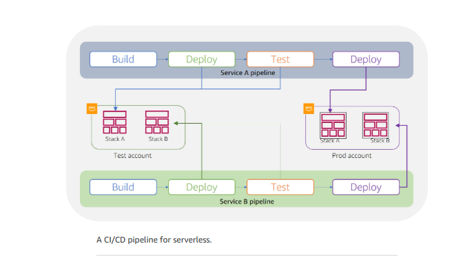

## Configuring your Lambda functions

When building and testing a function, you must specify three primary configuration settings: memory, timeout, and concurrency.

### Memory

Up to 10 GB of memeory to a Lambda function.Lambda allocates CPU and other resources linearly in proportion to the amount of memory configured. Any increase in memory size triggers an equivalent increase in CPU available to your function.

### Timeout

The AWS Lambda timeout value dictates how long a function can run before Lambda terminates the Lambda function.

### Lmabda billing costs

With AWS Lambda, you pay only for what you use. You are charged based on the number of requests for your functions and the duration, the time it takes for your code to run. Lambda counts a request each time it starts running in response to an event notification or an invoke call, including test invokes from the console.

### The balance between power and duration

Depending on the function, you might find that the higher memory level might actually cost less because the function can complete much more quickly than at a lower memory configuration.

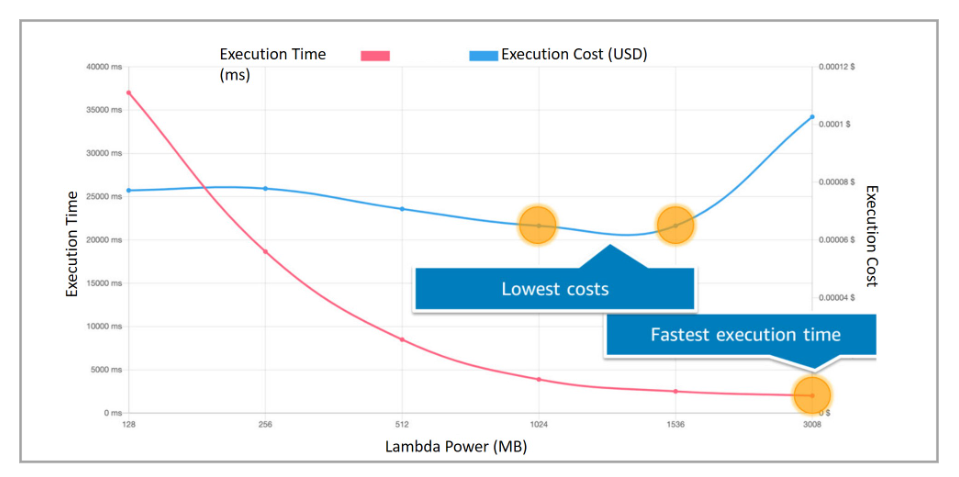

### Concurrency and scaling

Having more than one invocation running at the same time is the function's concurrency.

#### Concurrency types

- Unreserved concurrency

  The amount of concurrency that is not allocated to any specific set of functions. The minimum is 100 unreserved concurrency. This allows functions that do not have any provisioned concurrency to still be able to run.

- Reserved concurrency

  Guarantees the maximum number of concurrent instances for the function.

- Provisioned concurrency

  Initializes a requested number of runtime environments so that they are prepared to respond immediately to your function's invocations. This option is used when you need high performance and low latency.

#### Reasons for setting concurrency limits

- Limit concurrency

  - Limit costs
  - Regulate how long it takes you to process a batch of events
  - Match it with a downstream resource that cannot scale as quickly as Lambda

- Reserve concurrency

  - Ensure that you can handle peak expected volume for a critical function
  - Address invocation errors

### How concurrency bursts are managed

A burst is when there is a sudden increase in the number of instances needed to fulfill the requested number of running functions.

The burst quotas differ by region:

- 3000 – US West (Oregon), US East (N. Virginia), Europe (Ireland)

- 1000 – Asia Pacific (Tokyo), Europe (Frankfurt), US East (Ohio)

- 500 – Other Regions

### CloudWatch metrics for concurrency

When your function finishes processing an event, Lambda sends metrics about the invocation to Amazon CloudWatch. You can build graphs and dashboards with these metrics in the CloudWatch console.

- Two build-in Cloudwatch metrics

  1. ConcurrentExecutions

  2. UnreservedConcurrentExecutions

### Testing Concurrency

- Run performance test that simulate peak levels of invocations
- Determine whether the existing backend can handler the speed of rquests sent to it.
- Does the error handling work as expected.

## Deploying and Testing Serverless Applications

### Test and debug application

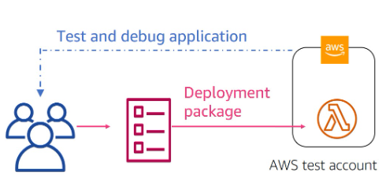

### Ensures environmental parity

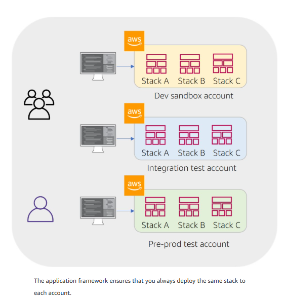

### Reduce risk using versions and aliases

- Versioning

  For example, you can publish a new version of a function for beta testing without affecting users of the stable production version. Lambda creates a new version of your function each time that you publish the function. The new version is a copy of the unpublished version of the function.

- Publish

  Publish makes a snapshot copy of $LATEST.

  Enable versioning to create immutable snapshots of your function every time you publish it.

  - Publish as many versions as you need.
  - Each version results in a new sequential version number.
  - Add the version number to the function ARN to reference it.
  - The snapshot becomes the new version and is immutable.

- Aliases

  A Lambda alias is like a pointer to a specific function version. You can access the function version using the alias ARN. Each alias has a unique ARN. An alias can point only to a function version, not to another alias. You can update an alias to point to a new version of the function.

### Test using alias routing

You can also use routing configuration on an alias to send a portion of traffic to a second function version.For example, you can reduce the risk of deploying a new version by configuring the alias to send most of the traffic to the existing version and only a small percentage of traffic to the new version.

You can point an alias to a maximum of two Lambda function versions. The versions must meet the following criteria:

- Both versions must have the same runtime role.
- Both versions must have the same dead-letter queue configuration, or no dead-letter queue configuration.
- Both versions must be published. The alias cannot point to $LATEST.

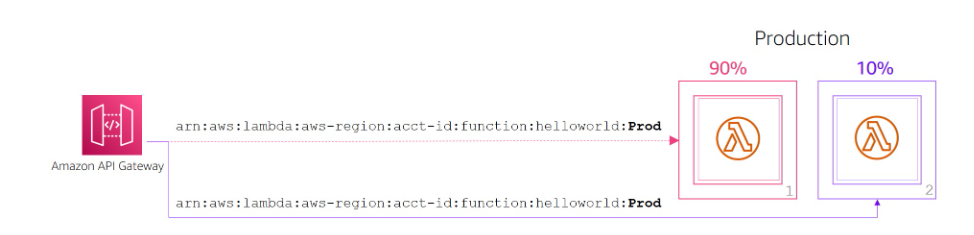

### Integrate with AWS CodeDeploy

## Monitoring and Troubleshooting

### Types of monitoring graphs

- Number o requests
- Invocation duration per request
- Number of requests that result in an error

Amazon CloudWatch provides built-in matrics:

- Invocations
- Duration
- Errors
- Throttles

  The number of times that a process failed because of concurrency limits.

- IteratorAge

  Pertains to event source mappings that read from streams. The age of the last record in the event. The age is the amount of time between when the stream receives the record and when the event source mapping sends the event to the function.

- DeadLetterErrors

  For asynchronous invocation, this is the number of times Lambda attempts to send an event to a dead-letter queue but fails.

- ConcurrentExecutions

  The number of function instances that are processing events.

  - UnreservedConcurrentExecutions – The number of events that are being processed by functions that don't have reserved concurrency.
  - ProvisionedConcurrentExecutions – The number of function instances that are processing events on provisioned concurrency. For each invocation of an alias or version with provisioned concurrency, Lambda emits the current count.

### Amazon CloudWatch Lambda Insights

Amazon CloudWatch Lambda Insights is a monitoring and troubleshooting solution for serverless applications running on Lambda. Lambda Insights collects, aggregates, and summarizes system-level metrics. It also summarizes diagnostic information such as cold starts and Lambda worker shutdowns to help you isolate issues with your Lambda functions and resolve them quickly

### Monitoring Lambda functions using AWS X-Ray

You can use AWS X-Ray to visualize the components of your application, identify performance bottlenecks, and troubleshoot requests that resulted in an error. Your Lambda functions send trace data to X-Ray, and X-Ray processes the data to generate a service map and searchable trace summaries.

AWS X-Ray records how the Lambda functions are running.

- Turning performance
- Identifying the call flow if Lambda functions and API calls
- Tracing path and timing of an invocation to locate bottlenecks and failures

### Additional monitoring and troubleshooting tools

- AWS Cloudtrail

  AWS CloudTrail helps audit your application by recording all the API actions made against the application. These logs can be exported to the analysis tool of your choice for additional analysis.

  - The default Lambda CloudTrail logging is for control plane (management) events.
  - Optional logging: CloudTrail also logs data events. You can turn on data event logging so that you log an event every time Lambda functions are invoked.

  CloudTrail can be an important tool for auditing serverless deployments and rolling back unplanned deployments.

- Dead-letter queues

  Dead-letter queues help you capture application errors that must receive a response, such as an ecommerce application that processes orders. If an order fails, you cannot ignore that order error. You move that error into the dead-letter queue and manually look at the queue and fix the problems.

  - Use dead-letter queues to analyze failures for follow-up or code corrections.
  - Dead-letter queues are available for asynchronous and non-stream polling events.
  - A dead-letter queue can be an Amazon Simple Notification Service (Amazon SNS) topic or an Amazon Simple Queue Service (Amazon SQS) queue.
