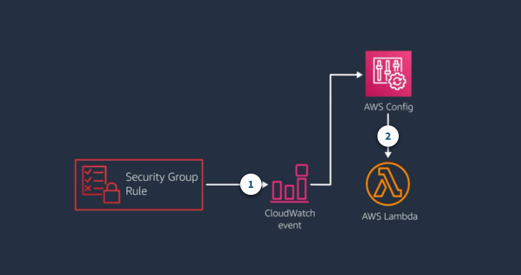
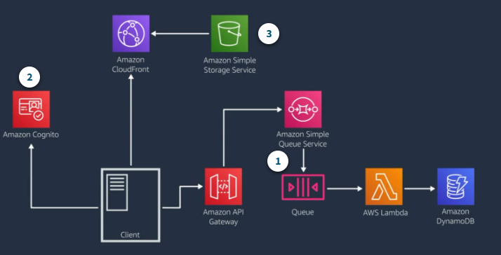

# Architecting Serverless Application

## Migrating to Serverless

The Key to thinking serverless is thinking in terms of patterns and applications, rather than in terms of individual functions or resources.

### Migration patterns

While designing your application, it's critical for you to choose services and patterns that suit your workloads based on characteristics such as expected throughput, service limits, and cost.

You can look at the migration in the context of the two paradigm shifts that need to be considered:

1. How do you implement computing infrastructure ?

2. How do you approach application developement and deployment ?

#### Infrastructure abstraction and architecture modernization

1. Capacity processes and cost models

This reflects the three typical ways of operating your infrastructure: server based, containerized, and APIs and microservice.

2. Operational and development models

From an operational and developement perspective, the modernization spectrum moves from the simplest move to the cloud - but manual, less flexible build nad deploy processes- to API-driven microservice-based application that allow or the greatest flexibility and agility but require a more significant rewrite of legacy applications.

3. Monolithic, Server based

Single artifact releases have more manual deployments and a single technology stack. There is minimal impact moving application to the cloud.

4. Containerized

Containerized applications provide platform ndependence, environment parity, and more straightforward deployments with limited code rewirtes.

5. Event-driven microservices

This includes continuous integration/continuous deployment(CI/CD) with polyglot technology stacks and frequent releases. Applications typically need to be rewritten.

- Leapfrog

As the name suggests, with the leapfrg pattern, you bypass interim steps and go straight from an on-premises legacy architecture to a serverless cloud architecture.

- Orginic

With the organic pattern, you move on-premises applications to the cloud in more of a lift-and-shift model.

Developers experiment with Lambda in low-risk internal scenarios such as log processing or cron jobs. As you gain more experience, you might use serverless components for tasks such as data transformations and parallelization of processes.

At some point in the adoption curve, you take a more strategic look at how serverless and microservices might address business goals such as market agility, developer innovation, and total cost of ownership.

- Strangler

With the strangler pattern, an organization incrementally and systematically decomposes monolithic applications by creating APIs and building event-driven components that gradually replace components of the legacy application.

### Migration considerations

- What does this application do and how are it's components organized ?

- How can break up your data based on the command query responsibility segregation, or CQRS, pattern? What belongs on the control plane and what belongs on the data plane?

- How does the application scale and what components drive the capacity you need ?

- Do you have schedule-based tasks?

- Do you have workers listening to a queue?

- Where can you refactor or enhance functionality without impacting the current implementation?

It's important to compare costs across three factors:

1. The infrastructure cost to run your workload;

2. The development effort to plan, architect, and provision resources on which the application will run.

3. The costs of your team's time to maintain the application once it's in production.

You also need to consider the business value of the increased speed and agility serverless gives you.

## Choosing Compute Services and Data Stores

Your goal should be to use the most optimized compute for each workload and use case.

### Use AWS Fargate and AWS Lambda function for serverless compute

#### Considerations for choosing Fargate or Lambda for serverless compute

1. AWS Fargate

When selecting to use either Fargate or Lambda for your serverless compute, consider the differences between the two and the needs of your workload.

- Lift and shift with minimal rework
- Longer-running processes or larger deployment packages
- Predictable, consistent workload
- Need more than 3 GB of memory
- Application with a non-HTTP/S listener
- Run side cars with your service(agents only supported as side cars)
- Container image portability with Docker runtime.

2. AWS Lambda

- Task that run less than 15 minutes
- Spiky, unpredictable workloads
- Unkonwn demand
- Lighter-weight, application-focused stateless computing
- Simplified IT automation
- Real-time data processing
- Reduced complexity for development and operations

You might also find that using a combination of Lambda and Fargate makes sense within your application.For example, if you have a component that runs on a Docker image, you might run it on Fargate and orchestrate it from an AWS Step Functions task.

It's critical to separate and model your data stores into transactional compared to query needs. Use the concepts expressed in the CQRS pattern to choose a data store designed for the type of work the database needs to do.

1. Amazon S3

- Data lakes
- Economical state store
- Claim-check pattern
- Filter data retrieved by Lambda(S3 Select)

2. Amazon DynamoDB

- Key-Value data store with millisecond response time
- Capture changes with Amazon DynamoDB Streams and index to other data stores

3. Amazon ElastiCache for Redis

- Well suited for things like realtime leaderboards
- in-memory data store with sub-millisecond read and write latency

5. Amazon Quantum Ledger Database

- Model state changes in cryptographically provable manner
- Distributed ledger

6. Amazon Aurora

- High-volume, high-throughput and highly parallelized transactional data
- MySQL and Postgres-compatible relational database built for faster performance at lower costs.
- Aurora Serverless automatically starts up, scale, and shuts down based on traffic.

7. Amazon Relational Database Services(Amazon RDS)

- Run familiar database engines with less administration

## Application Architecture Patterns

### Serverless IT automation

IT automation is often one of the first places organizations introduce serverless components. It can give you a quick win with very low risk.

#### Example: Automate response to configuration changes

1. CloudWatch event for security group change

A CloudWatch eventis fired off whenever someone modifies a security group.

2. Lambda function evaluates the change

The CloudWatch event triggers a Lambda function through AWS Config that has custom code to review a list of wathc security group rules are allowed or denied.

If the update is not allowed, the function deletes the rule and uses Amazon SNS to Send an Email alert.

### Serverless web application

A common event-driven pattern forms the basic backbone of a serverless web application architecture using Amazon API Gateway to handle HTTP requests, Lambda to provide the application layer, and Amazon DynamoDB to provide database functionality.

#### Example: Web application

1. Start with the basic pattern

When a request comes in, API Gateway send it to Amazon SQS and gets a message ID back, which the client can use to track the message.

The message is stored durably on the queue and the Lambda server polls the queue. If Lambda find new messages on the queue, it invokes the lambda fucntion using the message as a parameter.

2. Authentication

You can use Amazon Cognito for sign-up and sign-in functionality.

3. Amazon S3 and CloudFront serve static assets

Add an S3 bucket to host static assets for the website and CloudFront distribution to serve assets to geographically dispersed consumer.

You can adapt this architecture for single page web application by makeing use of S3 object versioning, Cloud Front cache expiration, and fine-tuned content time to live settings.

#### Example : Mobile backend

1. AWS Appsync provides a single endpoint

AWS AppSync provides one endpoint to the mobile application, but then spans out to interact with lots of backend services.

User interact with the backend through GraphQL operations against AWS AppSync and AWS service APIs.

AWS AppSync manages GraphQL HTTP requests and responses.

2. Amazon Cognito lets users leverage social identities.

Amazon Cognito provides user management and acts as an identity provider for the mobile application.

3. Amazon Elasticsearch Service for search and analytics

DynamoDB Streams indexes relevant data to Amazon Elasticsearch Service(Amazon ES) through a Lambda function.

You can use Amazon ES for both search engine and for analytics.

4. Amazon Pinpoint for analytics and targeted communications

Amazon Pinpoint captures analytics data from clients and also sends targeted texts or emails based on user data.
