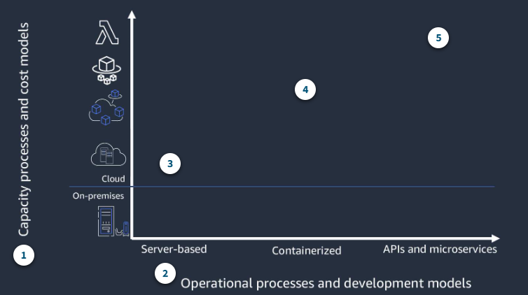

# Architecting Serverless Application

## Migrating to Serverless

The Key to thinking serverless is thinking in terms of patterns and applications, rather than in terms of individual functions or resources.

### Migration patterns

While designing your application, it's critical for you to choose services and patterns that suit your workloads based on characteristics such as expected throughput, service limits, and cost.

You can look at the migration in the context of the two paradigm shifts that need to be considered:

1. How do you implement computing infrastructure ?

2. How do you approach application developement and deployment ?

#### Infrastructure abstraction and architecture modernization

1. Capacity processes and cost models

This reflects the three typical ways of operating your infrastructure: server based, containerized, and APIs and microservice.

2. Operational and development models

From an operational and developement perspective, the modernization spectrum moves from the simplest move to the cloud - but manual, less flexible build nad deploy processes- to API-driven microservice-based application that allow or the greatest flexibility and agility but require a more significant rewrite of legacy applications.

3. Monolithic, Server based

Single artifact releases have more manual deployments and a single technology stack. There is minimal impact moving application to the cloud.

4. Containerized

Containerized applications provide platform ndependence, environment parity, and more straightforward deployments with limited code rewirtes.

5. Event-driven microservices

This includes continuous integration/continuous deployment(CI/CD) with polyglot technology stacks and frequent releases. Applications typically need to be rewritten.

- Leapfrog

As the name suggests, with the leapfrg pattern, you bypass interim steps and go straight from an on-premises legacy architecture to a serverless cloud architecture.

- Orginic

With the organic pattern, you move on-premises applications to the cloud in more of a lift-and-shift model.

Developers experiment with Lambda in low-risk internal scenarios such as log processing or cron jobs. As you gain more experience, you might use serverless components for tasks such as data transformations and parallelization of processes.

At some point in the adoption curve, you take a more strategic look at how serverless and microservices might address business goals such as market agility, developer innovation, and total cost of ownership.

- Strangler

With the strangler pattern, an organization incrementally and systematically decomposes monolithic applications by creating APIs and building event-driven components that gradually replace components of the legacy application.

### Migration considerations

- What does this application do and how are it's components organized ?

- How can break up your data based on the command query responsibility segregation, or CQRS, pattern? What belongs on the control plane and what belongs on the data plane?

- How does the application scale and what components drive the capacity you need ?

- Do you have schedule-based tasks?

- Do you have workers listening to a queue?

- Where can you refactor or enhance functionality without impacting the current implementation?

It's important to compare costs across three factors:

1. The infrastructure cost to run your workload;

2. The development effort to plan, architect, and provision resources on which the application will run.

3. The costs of your team's time to maintain the application once it's in production.

You also need to consider the business value of the increased speed and agility serverless gives you.

## Choosing Compute Services and Data Stores

Your goal should be to use the most optimized compute for each workload and use case.

