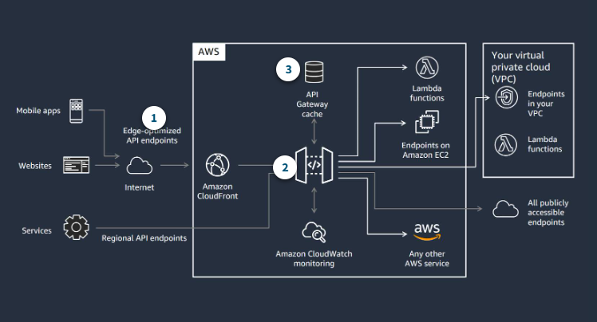

# 05 Scaling Serverless Architectures

## Thinking Serverless at Scale

Scalability means that successful, growing systems often see an increase in demand over time. A system that is scalable can adapt to meet this new level of demand.

### Build today with tomorrow in mind

You can update your architectures separately and iterate and learn from each iteration. This modularity aims to break your complex components or solutions into smaller parts that are less complicated and easier for you to scale, secure, and manage.

### Scaling best practices

- Separate your application and database
- Take advantage of the AWS Global Cloud Infrastructure
- Identify and avoid heavy lifting.
- Monitor for percentile.
- Refactory as you go.

## Scaling considerations for Serverless Services

### Scaling considerations

- Timeouts
- Retry behaviours
- Throughput
- Payload size

### Scaling considerations for API gateway

1. Trade-offs and optimizations are key.
2. Do production-like load testing end to end.
3. Stay abreast of updates to the services and take advantage of improvements.

### API Gateway features help you manage access patterns

API Gateway is your front door, and you have configuration options for each API that can help you manage the access pattern that you’re expecting.

1. Edge-optimized endpoints

Edge-optimized endpoints have a built-in Amazon CloudFront distribution to serve content quickly for geographically dispersed clients.

2. Throttling options

Set throttling limits by method. Set up API keys and usage plans to throttle request volume client by client.

3. Optional cache

Optional API Gateway cache can reduce hits on your backend.

## Scaling considerations for Amazon SQS

### Charateristics of an SQS queue as a Lambda event source

| Parameter | Value or Limit | How the Parameter is Set or Changed |
| :--- | :--- | :--- |
| Number of messages that can be in a batch | 1 to 10 | Configured with the event source on the Lambda function |
| Number of default pollers (batches returned at one time) | 5 | Managed by the Lambda service |
| Rate at which Lambda increases the number of parallel pollers | Up to 60 per minute | Managed by the Lambda service |
| Number of batches that Lambda manages simultaneously | Up to 1,000 | Managed by the Lambda service |
| Number of Lambda functions that can be running simultaneously | The lesser of 1,000 functions and the account limit | Configured by setting a limit (reserved concurrency) on the function |
| Messages per queue | No limit | N/A |
| Visibility timeout | 0 seconds to 12 hours | Configured on the queue |
| Number of retries | 1 to 1,000 | Configured on the queue (maxReceiveCount) |
| Function timeout | 0 seconds to 15 minutes | Configured on the function |

