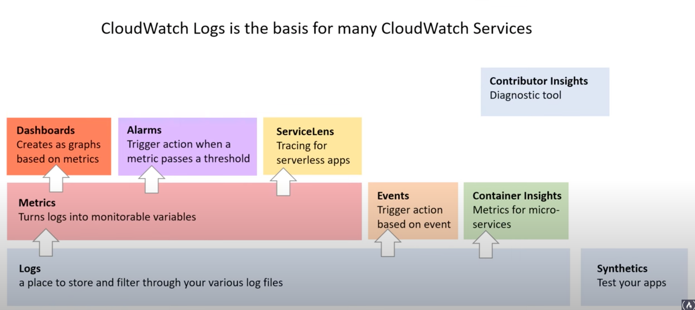
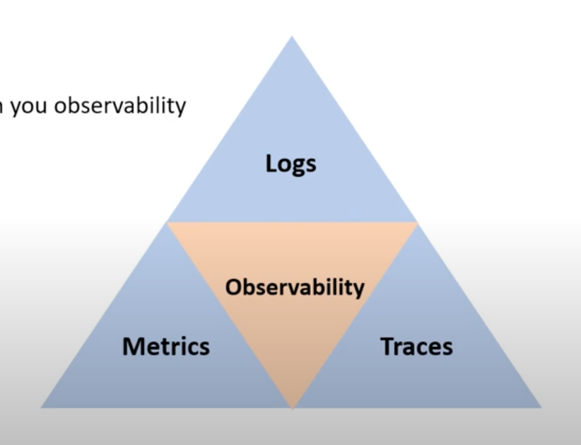

# AWS Cloud Watch

## Introduction


## Observability


## Logs
- Export to S3
- Stream to ElasticSearch
- Stream to CloudTrail Events and CloudWatch Logs Insights
- Log Security
  - Log Filtering
  - Log Retention

### Log Groups
### Log Streams

### Log Basis

#### Create Log Group
```sh
aws logs create-log-group --log-group-name "/example/basic/app"
```
#### with retention
```sh
aws logs put-retention-policy --log-group-name "/example/basic/app" --retention-in-days 1
```

#### Create Log Stream
```sh
aws logs create-log-stream --log-group-name "/example/basic/app" --log-stream-name "2021-01-01"
```