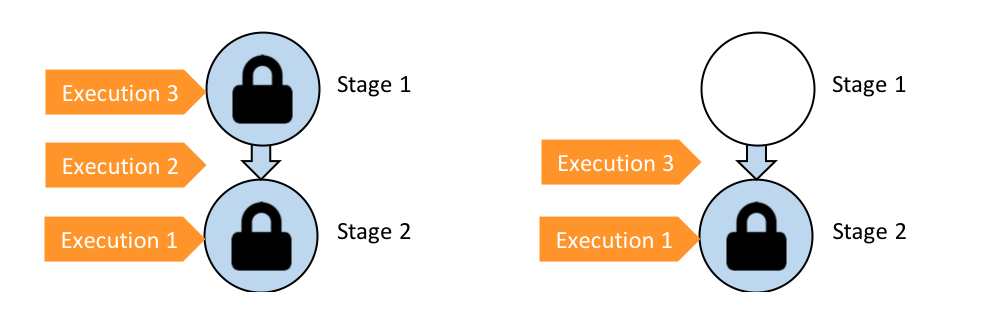

# How Pipeline executions work

## Pipeline Stop

recommand use the stopand wait option to stop the pipeline execution.

## How execution proceed in SUPERSEDED mode

- When a new execution is started, the previous execution is marked as `SUPERSEDED`.

### Rule 1: Stages are locked when an execution is being processed

 Each stage can process only one execution at a time, the stage is locked while the execution is being processed. when the execution is completed, the stage is unlocked, it transitions to the next stage.

### Rule 2: Subsequent executions wait fot the stage to be unlocked
  
  When a stage is locked, subsequent executions wait for the stage to be unlocked. When the stage is unlocked, the next execution can proceed.

### Rule 3: Waiting executions are superseeded by more recent executions

  When a stage is unlocked, the next execution can proceed. If there are multiple waiting executions, the most recent execution proceeds first.

