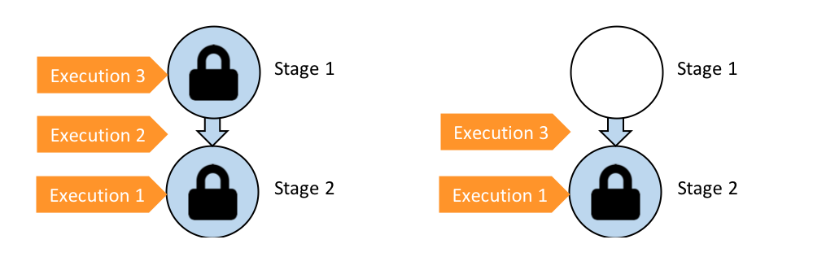

# How Pipeline Executions Work

## Pipeline Stop

We recommend using the "stop and wait" option to stop a pipeline execution.

## How Execution Proceeds in SUPERSEDED Mode

- When a new execution is started, the previous execution is marked as `SUPERSEDED`.

### Rule 1: Stages are locked when an execution is being processed

Each stage can process only one execution at a time. The stage is locked while the execution is being processed. When the execution is completed, the stage is unlocked, and it transitions to the next stage.

### Rule 2: Subsequent executions wait for the stage to be unlocked
  
When a stage is locked, subsequent executions wait for the stage to be unlocked. When the stage is unlocked, the next execution can proceed.

### Rule 3: Waiting executions are superseded by more recent executions

When a stage is unlocked, the next execution can proceed. If there are multiple waiting executions, the most recent execution proceeds first.

