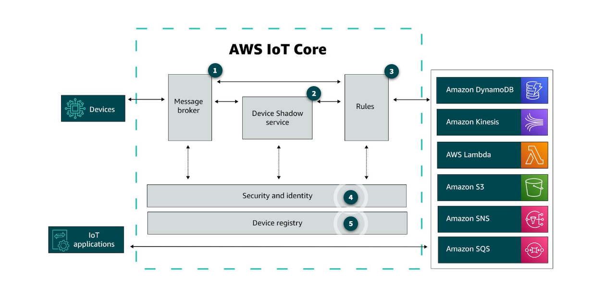

# AWS IoT

## IoT Services

- Annlytics
  - IoT SiteWise
  - IoT Events
  - IoT Analytics
  - IoT TwinMaker

- Control services
  - IoT Core
  - IoT Device Defender
  - IoT Device Management
  - IoT Things Graph

- Device software
  - FreeRTOS
  - Greengrass
  - IoT Device SDK
  - IoT Device Tester

## Oerview

## Message Broker

To publish and receive message from each other devices.

## Device Shadow

To store the current state of each device. allows user to communicate with devices even when they are offline.

## Rules

To connect data from the message broker to other AWS services.

## Security and identity

To provide shared responsibility for security in the cloud.

## Device registry

Is a database to store information about each device.
