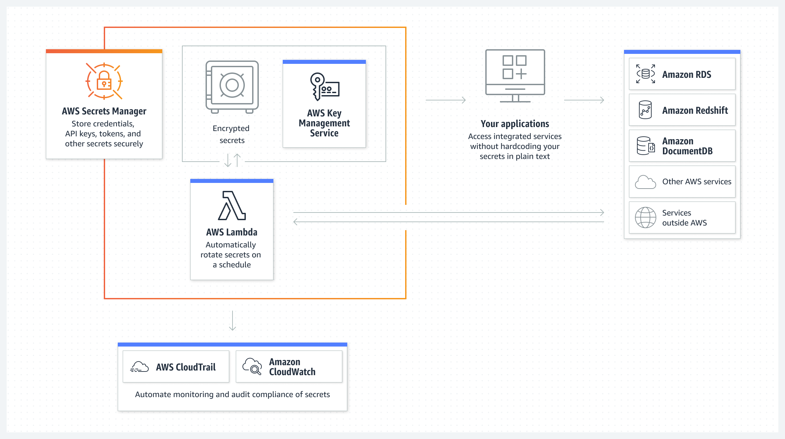

# AWS Secrets Manager

## What secrets can be stored in Secrets Manager?

- AWS Credentials
- Encryption keys
- SSH keys
- Private keys and certificates

## Secrets Manager Features

## How to create a secret in AWS Secrets Manager?
