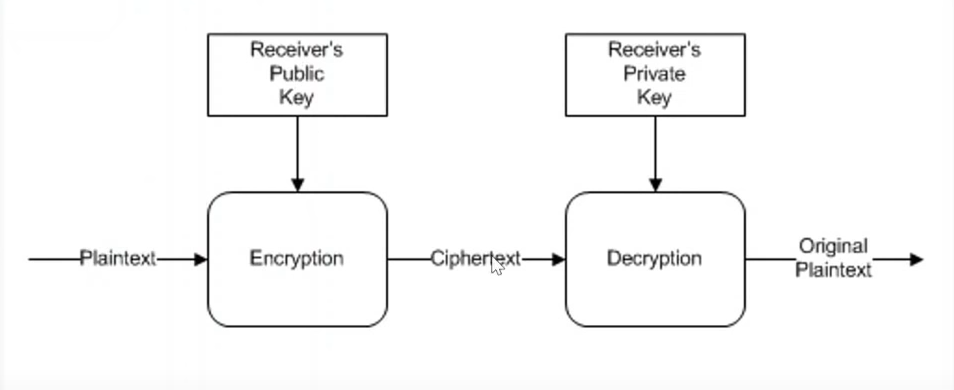

# Cryptography

## Hash Functions

- One-way function - cannot be reversed
- Fixed length output

```csharp
public void OnGet()
{
  var plainText = "Hello World!";

  // MD5 Hash, create an instance of the MD5 hash algorithm
  SHA512 hashSvc = SHA512.Create();

  // Compute the hash value, returns a byte array
  byte[] hash = hashSvc.ComputeHash(Encoding.UTF8.GetBytes(plainText));

  // Convert the byte array to a hexadecimal string, because the hash is a byte array
  var hex = BitConverter.ToString(hash).Replace("-", "").ToLower();
}
```

## Encryption and decryption

### Symmetric Encryption

- Encryption and decryption use the same key
- Faster than asymmetric encryption
- Key management is difficult

## Symmetric algorithms

- .NET Symmetric algorithm are "block ciphers"
- Mode : ECB, CBC, CFB, OFB, CTR, GCM
- IV (Initialization Vector)
- Ramdom value that is used to initialize the encryption algorithm
- Does not need to be secret
- Must be unique for each message

```csharp
public string IV { get; set; }
public string CipherText { get; set; }
public string OriginalText { get; set; }

private Aes CreateCipher()
{
  // Create an instance of the AES algorithm
  Aes cipher = Aes.Create(); // Defaults - KeySize = 256, BlockSize = 128, Mode = CBC, Padding = PKCS7, IV = Random

  // cipher.Padding means that the data is padded to the block size, PaddingMode is a enumeration that specifies the type of padding to apply when the message data block is shorter than the full number of bytes needed for a cryptographic operation.
  cipher.Padding = PaddingMode.ISO10126;

  // use a constant key for encryption
  cipher.Key = conversions.HexToByteArray("2B7E151628AED2A6ABF7158809CF4F3C");

  return cipher;
}

public async Task<string> OnGetEncryptAsync()
{
  Aes cipher = CreateCipher();

  // Encrypt the data
  IV = Convert.ToBase64String(cipher.IV);

  // Create an encryptor for the cipher to use
  ICryptoTransform encryptor = cipher.CreateEncryptor();

  byte[] plainText = Encoding.UTF8.GetBytes("Hello World!");
  // Perform the encryption, returns a byte array, transformFinalBlock is used to process the last block of data
  byte[] cipherText = encryptor.TransformFinalBlock(plainText, 0, plainText.Length);

  CipherText = Convert.ToBase64String(cipherText);

  return CipherText;
}

public async Task<string> OnGetDecryptAsync()
{
  Aes cipher = CreateCipher();

  cipher.IV = Convert.FromBase64String(IV);

  ICryptoTransform decryptor = cipher.CreateDecryptor();

  byte[] cipherText = Convert.FromBase64String(CipherText);
  byte[] plainText = decryptor.TransformFinalBlock(cipherText, 0, cipherText.Length);

  OriginalText = Encoding.UTF8.GetString(plainText);

  return OriginalText;
}

```

### Asymmetric Algorithms

- Utilizes two complimentary keys (public and private)
  

- Generally slower than symmetric algorithms
- Often use asymmetric to encrypt a "session" symmetric key
- Abstract base class: RSA, ECDiffieHellman, ECDsa

```csharp
public string OriginalText { get; set; }
public string CipherText { get; set; }
public string plainText { get; set; }

private RSA CreateCipher()
{
  // RAS is an abstract class, so we use the Create method to create an instance of the RSA algorithm
  RSA cipher = RSA.Create(); // Defaults - KeySize = 2048

  // Read the public and private keys from the XML files
  cipher.FromXmlString(System.IO.File.ReadAllText("rsa-private.xml"));

  return cipher;
}

public async Task<string> OnPostEncryptAsync()
{
  RSA cipher = CreateCipher();

  // Encrypt the data
  byte[] data = Encoding.UTF8.GetBytes(plainText);
  byte[] cipherText = cipher.Encrypt(data, RSAEncryptionPadding.Pkcs1);
  CipherText = Convert.ToBase64String(cipherText);

  return CipherText;
}

public async Task<string> OnPostDecryptAsync()
{
  RSA cipher = CreateCipher();

  byte[] cipherText = Convert.FromBase64String(CipherText);
  byte[] data = cipher.Decrypt(cipherText, RSAEncryptionPadding.Pkcs1);
  OriginalText = Encoding.UTF8.GetString(data);

  return OriginalText;
}
```
